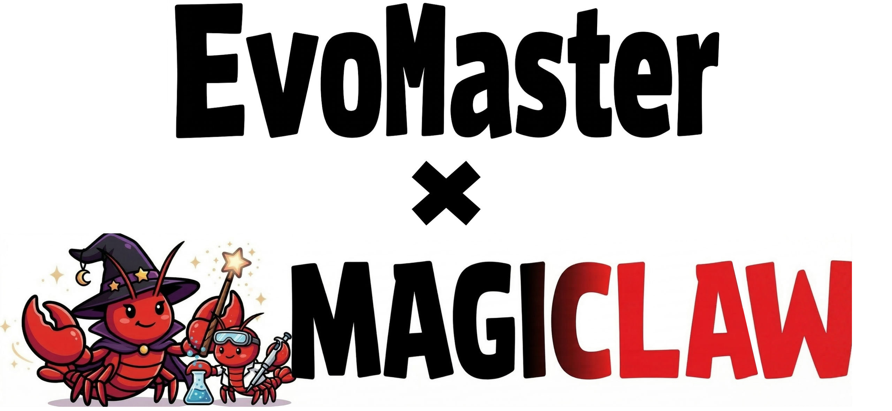

<p align="center">
  
</p>

<p align="center">
  <strong>【<a href="./README.md">English</a> | <a href="./README-zh.md">简体中文</a>】</strong>
</p>

<p align="center">
  <a href="#quick-start"></a>
  <a href="#scimaster-ecosystem"></a>
  <a href="#key-features"></a>
  <a href="./LICENSE"></a>
</p>

<div align="center">

**面向自主演进科研（Autonomous Scientific Research）的通用智能体基座**

*让科学智能体开发更简单、模块化且可扩展，加速「AI for Science」落地。*

<table align="center" width="100%">
<tr>
<td width="33%" align="center" valign="top">

**大模型训练**

https://github.com/user-attachments/assets/62c132c1-6fe8-4c18-89c6-be330fab2c6f

</td>
<td width="33%" align="center" valign="top">

**材料科学（Material Science）**

https://github.com/user-attachments/assets/590365c0-95a6-467e-a22b-3c373fb2bb8a

</td>
<td width="33%" align="center" valign="top">

**创建 ML 智能体**

https://github.com/user-attachments/assets/d5e2500b-f589-4676-b6cb-dce8ae000f2c

</td>
</tr>
</table>

</div>

---

## 目录

- [项目介绍](#introduction)
- [核心特性](#key-features)
- [SciMaster 生态](#scimaster-ecosystem)
- [路线图](#roadmap)
- [仓库结构](#repository-layout)
- [快速开始](#quick-start)
- [参与贡献](#contributing)

---

## <span id="introduction">📖 项目介绍</span>

**MagiClaw** 是面向飞书（Lark）的智能体助手：在会话里用自然语言描述需求，它会编排专用智能体完成复杂任务；需要时还能在 [EvoMaster](https://github.com/sjtu-sai-agents/EvoMaster) 框架上协助你设计、生成新的智能体。

**EvoMaster** 是底层轻量级智能体框架，负责工具调用、技能（Skills）、记忆、会话与 Playground 接线，让你把精力放在行为设计与提示词上，而不是重复造工程轮子。

---

## <span id="key-features">✨ 核心特性</span>

### 1. 💬 原生飞书 / Lark 体验

像和同事对话一样使用机器人：多轮上下文、卡片交互，以及可选的飞书文档相关能力，贴合团队日常协作习惯。

### 2. 🔀 编排与委托

默认 **magiclaw** 可通过工具把工作交给其他已注册的 Playground（例如 **agent_builder**），同一段对话即可驱动多步或元级（造智能体）流程。

### 3. 🧰 丰富的工具面

在 `configs/magiclaw/config.yaml` 中可配置 **MCP**、网页搜索与抓取、可选飞书读文/发文件、**Skills** 与持久化 **记忆** 等。

### 4. 🏗️ 建立在 EvoMaster 之上

与 EvoMaster 生态一致：可插拔的 LLM 接入、本地或容器会话，代码体量小、便于二次开发。

### <span id="scimaster-ecosystem">SciMaster 生态</span>

完整的 **SciMaster** 系列（ML-Master、X-Master、Browse-Master 等）位于上游仓库 [EvoMaster](https://github.com/sjtu-sai-agents/EvoMaster)。本仓库聚焦飞书助手与 `agent_builder` 路径；若需要其他 Playground，可从 EvoMaster 同步或自行接入。

---

## <span id="roadmap">🗺️ 路线图（概要）</span>

| 阶段 | 重点 |
|------|------|
| **当前** | MagiClaw 飞书机器人、`magiclaw` + `agent_builder`、核心 `evomaster` 库 |
| **后续** | 积极适配飞书 CLI 与相关工具，扩展飞书能力并改进部署体验 |

---

## <span id="repository-layout">🏗️ 仓库结构</span>

```
MagiClaw/
├── evomaster/              # 核心库（agent、core、interface/feishu、memory、skills …）
├── playground/
│   ├── magiclaw/         # 默认飞书对话智能体
│   └── agent_builder/      # 元智能体：设计 / 生成智能体
├── configs/
│   ├── feishu/             # 机器人接入与凭证
│   ├── magiclaw/         # LLM、工具、记忆、MCP
│   └── agent_builder/      # 规划 + 构建双智能体
├── run.py                  # 可选：命令行运行 Playground
├── requirements.txt
└── pyproject.toml
```

---

## <span id="quick-start">🚀 快速开始</span>

### 环境要求

- **Python** ≥ 3.12

### 安装

```bash
git clone https://github.com/sjtu-sai-agents/MagiClaw.git
cd MagiClaw
pip install -r requirements.txt
```

使用 [uv](https://docs.astral.sh/uv/) 时：

```bash
uv pip install -r requirements.txt
# 若使用项目元数据，也可：uv sync
```

### 1. 创建飞书应用与机器人

1. 打开 [飞书开放平台](https://open.feishu.cn/app) 并登录。  
2. 创建应用，并按指引启用 **机器人** 能力。

### 2. 配置应用凭证（`.env`）

将项目根目录的 `.env.template` 复制为 `.env`，在飞书开发者后台获取机器人的 **App ID**、**App Secret**，填入：

- `FEISHU_APP_ID`
- `FEISHU_APP_SECRET`

### 3. 导入权限（Scopes）

在开发者后台进入 **权限管理** → **批量导入/导出权限**，导入以下 JSON（可按实际功能裁剪）：

```json
{
  "scopes": {
    "tenant": [
      "im:resource",
      "docx:document",
      "docx:document:readonly",
      "drive:drive",
      "im:chat:readonly",
      "im:message",
      "im:message.group_at_msg:readonly",
      "im:message.group_msg",
      "im:message.p2p_msg:readonly",
      "im:message:readonly",
      "im:message:recall",
      "im:message:send_as_bot",
      "wiki:wiki:readonly"
    ],
    "user": [
      "drive:drive",
      "drive:drive.metadata:readonly",
      "drive:drive.search:readonly",
      "drive:drive:readonly",
      "drive:drive:version",
      "drive:drive:version:readonly"
    ]
  }
}
```

### 4. 事件订阅（长连接）

**事件与回调** → **事件配置** → 选择 **使用长连接接收事件**，添加：

| 说明 | 事件名 |
|------|--------|
| 机器人进群 v2.0 | `im.chat.member.bot.added_v1` |
| 机器人被移出群 v2.0 | `im.chat.member.bot.deleted_v1` |
| 消息已读 v2.0 | `im.message.message_read_v1` |
| 消息撤回 v2.0 | `im.message.recalled_v1` |
| 接收消息 v2.0 | `im.message.receive_v1` |

### 5. 回调订阅（长连接）

**事件与回调** → **回调配置** → **使用长连接接收回调**，订阅：

| 说明 | 回调 |
|------|------|
| 卡片回传交互 | `card.action.trigger` |

### 6. 发布版本

在 **版本管理与发布** 中创建版本、填写信息后 **发布**，使线上机器人可用。

### 7. 配置 LLM 与其他 API

编辑根目录 `.env`，配置 LLM、搜索等 API 密钥与地址。默认模型与智能体行为可在 `configs/magiclaw/config.yaml` 中调整；飞书侧连接信息在 `configs/feishu/config.yaml`。

### 8. 启动飞书机器人

```bash
python -m evomaster.interface.feishu --config configs/feishu/config.yaml
```

启动成功后，即可在飞书中与 MagiClaw 对话。

---

## <span id="contributing">🤝 参与贡献</span>

欢迎通过 [Issue](https://github.com/sjtu-sai-agents/MagiClaw/issues) 反馈问题，或通过 Pull Request 提交改进。改动较大时，建议先开 Issue 对齐范围与方案。

本项目采用 [Apache 2.0](./LICENSE) 许可证。
